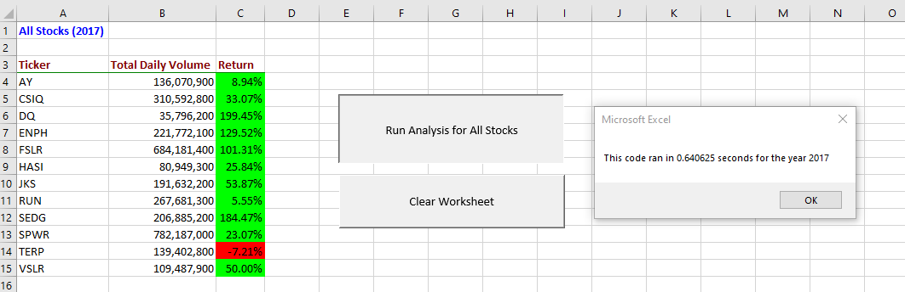
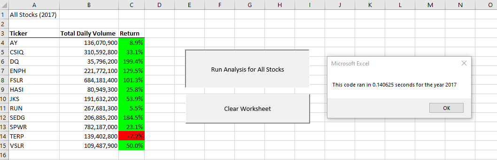
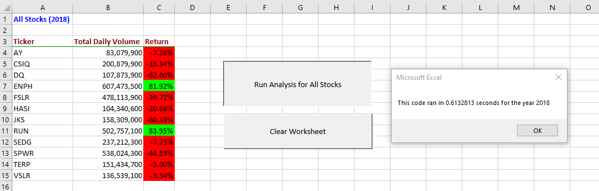
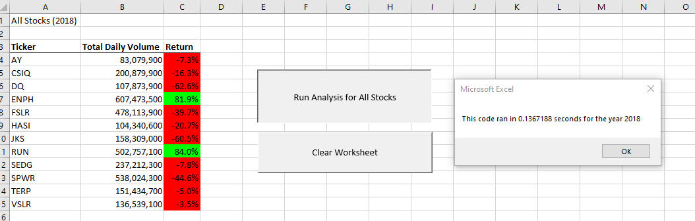

# stock-analysis

#### Repo for VBA module

#### Part of UTA-VIRT-DATA-PT-04-2021-U-B boot camp

#### Note to graders. 

Although I am perfectly capable of writing up a report, given the schedule, I think my time is better spent moving on to subsequent moodules.  Anyway, here are the screen shots:

#### Screenshot of execution result on original code for 2017 dataset

#### Screenshot of execution result on refactored code for 2017 dataset

#### Screenshot of execution result on original code for 2018 dataset

#### Screenshot of execution result on refactored code for 2018 dataset

